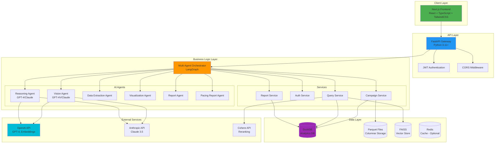
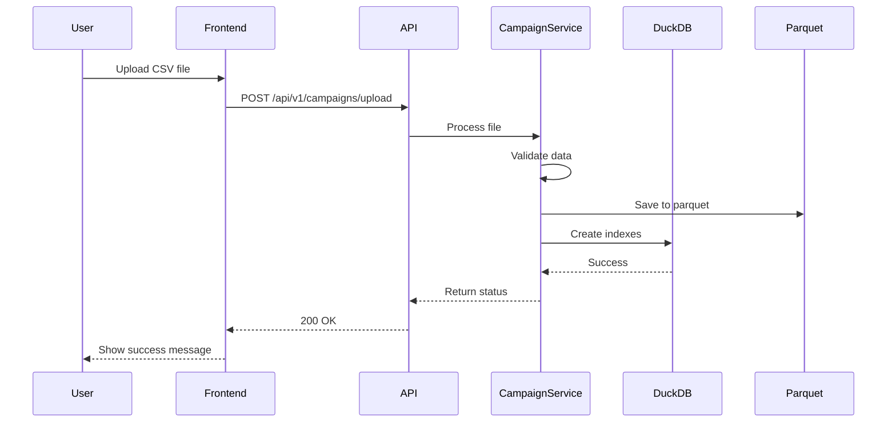
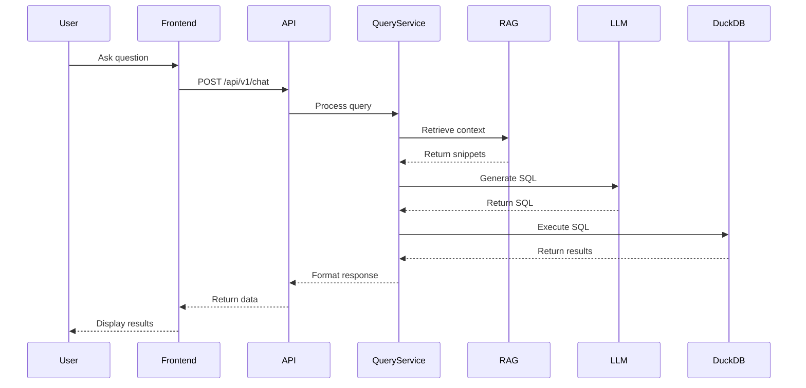
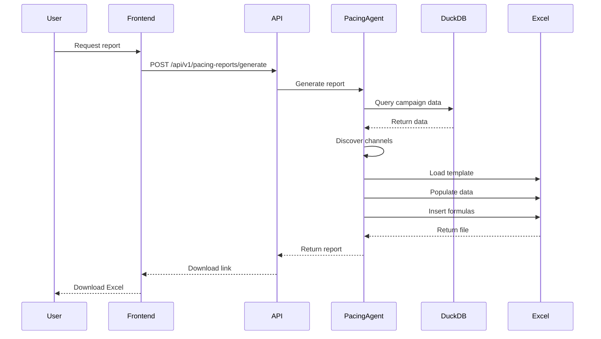
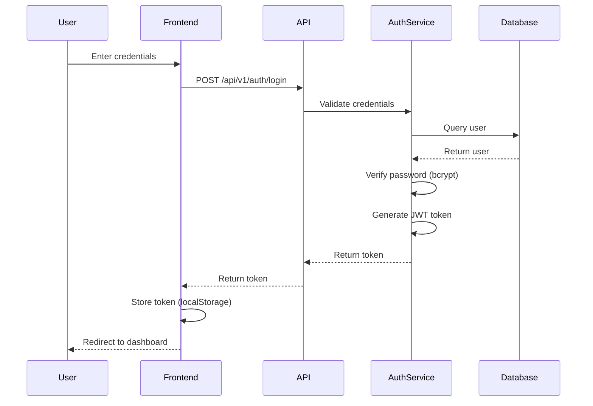
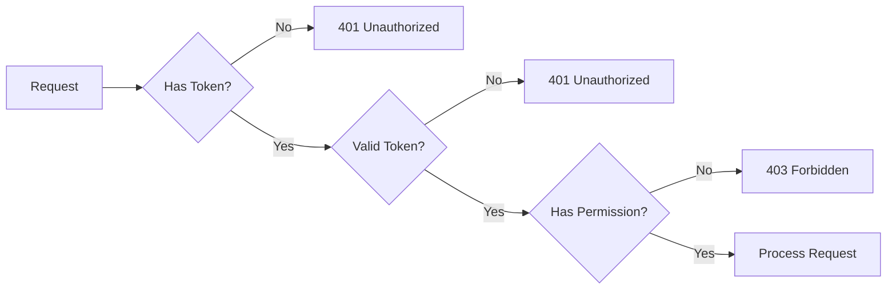

# PCA Agent - System Architecture

This document describes the technical architecture of the PCA Agent system.

---

## System Overview

PCA Agent is a multi-tier, AI-powered campaign analysis system built with modern web technologies and agentic AI patterns.



---

## Architecture Layers

### 1. Client Layer (Frontend)

**Technology**: Next.js 14, React 18, TypeScript, TailwindCSS

**Components**:
- **Pages**: Campaign management, analytics, reports, chat
- **Components**: Reusable UI components (charts, tables, forms)
- **State Management**: React hooks, context API
- **API Client**: Axios for HTTP requests
- **Visualizations**: Recharts library

**Key Features**:
- Server-side rendering (SSR)
- Static site generation (SSG)
- API routes for backend proxy
- Responsive design
- Real-time updates

---

### 2. API Layer (Gateway)

**Technology**: FastAPI, Python 3.11+

**Responsibilities**:
- Request routing
- Authentication/authorization (JWT)
- Input validation (Pydantic)
- CORS handling
- Rate limiting
- Error handling
- API documentation (OpenAPI/Swagger)

**Endpoints**:
```
/api/v1/
├── auth/           # Authentication
├── campaigns/      # Campaign management
├── pacing-reports/ # Pacing reports
├── regression/     # Regression analysis
├── chat/           # Natural language Q&A
├── knowledge/      # RAG knowledge base
├── visualizations/ # Data visualizations
└── intelligence/   # AI insights
```

---

### 3. Business Logic Layer

#### Multi-Agent Orchestrator (LangGraph)

**Purpose**: Coordinate AI agents for complex workflows

**Workflow Example** (Campaign Analysis):


#### AI Agents

1. **Vision Agent**
   - Extract data from screenshots
   - OCR for text recognition
   - Chart/graph interpretation
   - Models: GPT-4V, Claude 3.5 Sonnet

2. **Reasoning Agent**
   - Generate insights
   - Detect achievements
   - Provide recommendations
   - Cross-channel analysis

3. **Data Extraction Agent**
   - Normalize multi-platform data
   - Validate data quality
   - Handle missing values
   - Data type conversion

4. **Visualization Agent**
   - Create charts and graphs
   - Generate infographics
   - Comparison visuals

5. **Report Agent**
   - Generate PowerPoint reports
   - Apply branding
   - Insert visualizations
   - Format data tables

6. **Pacing Report Agent**
   - Adaptive sheet population
   - Dynamic pivot analysis
   - Formula preservation
   - Excel template processing

#### Services

1. **Campaign Service**
   - CRUD operations
   - Data upload/import
   - Filtering and aggregation
   - Export functionality

2. **Auth Service**
   - User registration/login
   - Password hashing (bcrypt)
   - JWT token generation
   - Session management

3. **Query Service**
   - Natural language to SQL
   - Query optimization
   - Result formatting
   - Query caching

4. **Report Service**
   - Report generation
   - Template management
   - Scheduling
   - Distribution

---

### 4. Data Layer

#### DuckDB (Analytics Database)

**Purpose**: Fast analytics queries on campaign data

**Features**:
- Columnar storage
- Parallel query execution
- Performance indexes
- SQL interface
- ACID compliance

**Schema**:
```sql
CREATE TABLE campaigns (
    Date DATE,
    Platform VARCHAR,
    Campaign VARCHAR,
    Spend DECIMAL(10,2),
    Impressions INTEGER,
    Clicks INTEGER,
    Conversions INTEGER,
    -- Additional metrics
);
```

#### Parquet Files (Data Storage)

**Purpose**: Compressed columnar storage for large datasets

**Advantages**:
- 10x compression vs CSV
- Fast column-based queries
- Type preservation
- Partitioning support

**Location**: `data/campaigns.parquet`

#### FAISS (Vector Store)

**Purpose**: Semantic search for RAG knowledge base

**Features**:
- Fast approximate nearest neighbor search
- OpenAI embeddings (text-embedding-3-small)
- Metadata filtering
- Hybrid retrieval (vector + keyword)

**Location**: `data/vector_store/faiss.index`

#### Redis (Cache - Optional)

**Purpose**: Caching for improved performance

**Use Cases**:
- Query result caching
- Session storage
- Rate limiting
- Celery task queue

---

### 5. External Services

#### OpenAI API

**Models Used**:
- GPT-4o (reasoning, chat)
- GPT-4-turbo (analysis)
- GPT-4V (vision)
- text-embedding-3-small (embeddings)

**Use Cases**:
- Natural language understanding
- Image analysis
- Embeddings for RAG
- Text generation

#### Anthropic API

**Models Used**:
- Claude 3.5 Sonnet (reasoning, vision)

**Use Cases**:
- Alternative to GPT-4
- Vision analysis
- Long-context reasoning

#### Cohere API

**Models Used**:
- rerank-english-v3.0

**Use Cases**:
- Reranking search results
- Improving RAG relevance

---

## Data Flow

### Campaign Upload Flow



### Natural Language Query Flow



### Pacing Report Generation Flow



---

## Security Architecture

### Authentication Flow



### Authorization Flow



---

## Deployment Architecture

### Development

```
┌─────────────────────────────────────┐
│  Local Machine                       │
│  ┌──────────┐      ┌──────────┐    │
│  │ Frontend │      │ Backend  │    │
│  │ :3000    │◄────►│ :8000    │    │
│  └──────────┘      └──────────┘    │
│                          │          │
│                    ┌─────▼─────┐   │
│                    │  DuckDB   │   │
│                    │  Parquet  │   │
│                    └───────────┘   │
└─────────────────────────────────────┘
```

### Production

```
┌─────────────────────────────────────────────┐
│  Cloud Infrastructure (AWS/GCP/Azure)        │
│                                              │
│  ┌────────────────────────────────────┐    │
│  │  Load Balancer                      │    │
│  └──────────┬─────────────────────────┘    │
│             │                                │
│  ┌──────────▼──────────┐  ┌──────────────┐ │
│  │  Frontend (Vercel)  │  │  CDN         │ │
│  │  Next.js SSR        │  │  (CloudFlare)│ │
│  └──────────┬──────────┘  └──────────────┘ │
│             │                                │
│  ┌──────────▼──────────────────────────┐   │
│  │  API Gateway (AWS API Gateway)      │   │
│  └──────────┬──────────────────────────┘   │
│             │                                │
│  ┌──────────▼──────────┐                    │
│  │  Backend (ECS/K8s)  │                    │
│  │  FastAPI + Gunicorn │                    │
│  │  Auto-scaling       │                    │
│  └──────────┬──────────┘                    │
│             │                                │
│  ┌──────────▼──────────┐  ┌──────────────┐ │
│  │  PostgreSQL (RDS)   │  │  Redis       │ │
│  │  Primary Database   │  │  (ElastiCache│ │
│  └─────────────────────┘  └──────────────┘ │
│                                              │
│  ┌──────────────────────┐                   │
│  │  S3 (File Storage)   │                   │
│  │  - Reports           │                   │
│  │  - Uploads           │                   │
│  └──────────────────────┘                   │
└─────────────────────────────────────────────┘
```

---

## Technology Stack Summary

| Layer | Technology | Purpose |
|-------|-----------|---------|
| **Frontend** | Next.js 14, React 18, TypeScript | User interface |
| **Styling** | TailwindCSS | UI styling |
| **Visualizations** | Recharts | Charts and graphs |
| **API** | FastAPI | REST API gateway |
| **Language** | Python 3.11+ | Backend logic |
| **AI Framework** | LangChain, LangGraph | Agent orchestration |
| **LLMs** | OpenAI GPT-4, Anthropic Claude | AI reasoning |
| **Database** | DuckDB | Analytics database |
| **Storage** | Parquet | Columnar data storage |
| **Vector DB** | FAISS | Semantic search |
| **Cache** | Redis (optional) | Caching layer |
| **Auth** | JWT, bcrypt | Authentication |
| **Testing** | Pytest, Playwright | Testing framework |
| **Deployment** | Docker, K8s | Containerization |

---

## Performance Considerations

### Optimization Strategies

1. **Database Indexing**
   - Indexes on Date, Platform, Channel, Region
   - Composite indexes for common filter combinations

2. **Query Optimization**
   - Parameterized queries
   - Query result caching (Redis)
   - Parallel query execution (DuckDB)

3. **Data Storage**
   - Parquet columnar format (10x compression)
   - Partitioning by date/platform
   - Snappy compression

4. **API Performance**
   - Response caching
   - Pagination for large datasets
   - Async request handling

5. **Frontend Optimization**
   - Code splitting
   - Lazy loading
   - Image optimization
   - SSR/SSG for faster initial load

---

## Scalability

### Horizontal Scaling

- **API**: Multiple FastAPI instances behind load balancer
- **Database**: Read replicas for PostgreSQL
- **Cache**: Redis cluster
- **Frontend**: CDN distribution

### Vertical Scaling

- **DuckDB**: Increase memory allocation
- **API**: Increase worker processes
- **Database**: Larger instance sizes

---

## Monitoring & Observability

### Metrics

- API response times
- Database query performance
- Error rates
- User activity
- Resource utilization

### Logging

- Application logs (JSON format)
- Access logs
- Error logs
- Audit logs

### Tools

- Prometheus (metrics)
- Grafana (dashboards)
- Sentry (error tracking)
- ELK Stack (log aggregation)

---

## References

- [FastAPI Documentation](https://fastapi.tiangolo.com/)
- [Next.js Documentation](https://nextjs.org/docs)
- [DuckDB Documentation](https://duckdb.org/docs/)
- [LangChain Documentation](https://python.langchain.com/)
- [OpenAI API Reference](https://platform.openai.com/docs/api-reference)

---

**Last Updated**: 2025-12-28  
**Version**: 1.0.0
